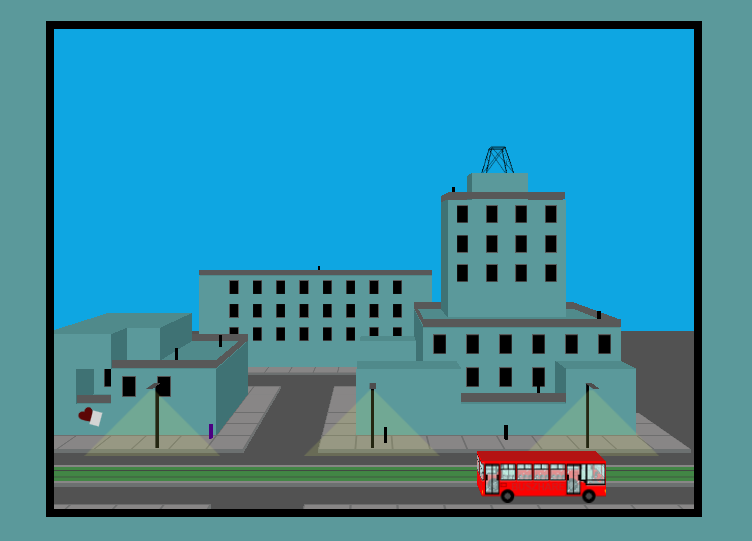
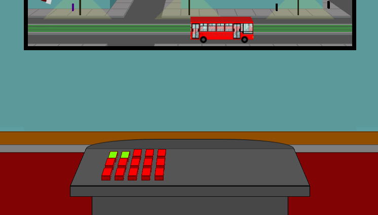

## Window diorama

Interactive diorama. HTML and CSS only.

This was made during a week that I was sick, time to practice!

The main features of the project are:
- Grids
- Perspective
- Animations.

Origin points of objects are a mess! A thing to keep in mind for the next project, a bit more planning will not hurt.

A bit hidden (the furthest guy on top of the building gives you some clues, zoom in to read them if you need to), there is a kind of control panel for the diorama, unfinished. Was meant to trigger some actions, like changing night and day or triggering animations.

