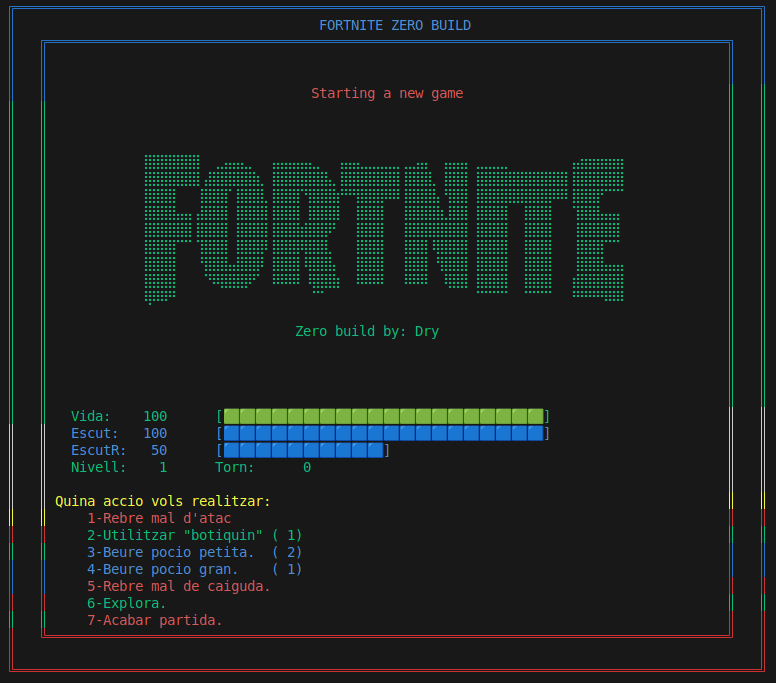
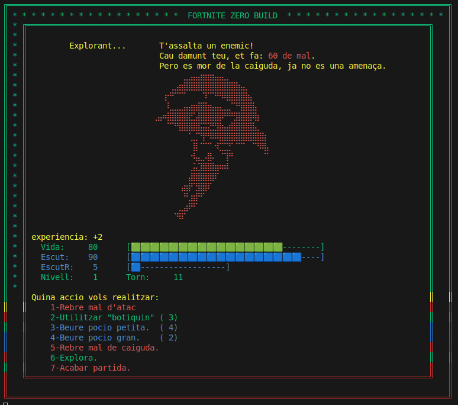
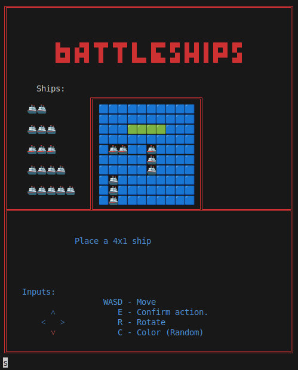
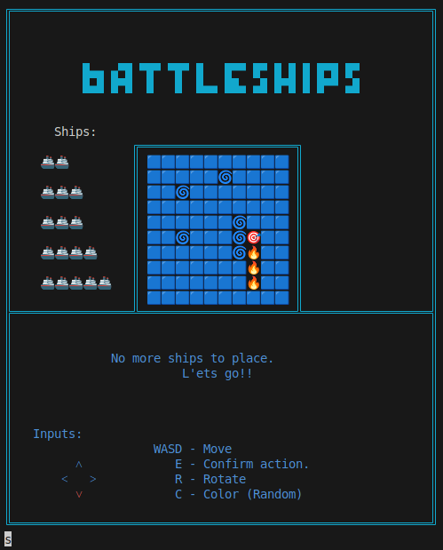

# Fortnite & Battleship Projects
This project contains the first two games I made while learning java, some details needed to properly finish.

## Fortnite Zero Build adventure

First weeks into Java, I created a small graphic adventure. It was supposed to be a minor extra assignment, but I discovered ANSI codes, that made coding for terminal fun! So I ended up expanding it… a bit too much.

---
Start screenshot:

Random event ingame:

## Battleship

Practicing functions and arrays

