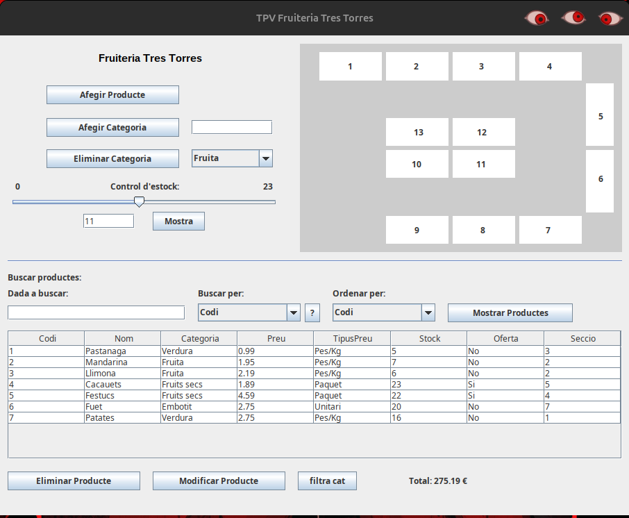

## TPV Fruiteria

End of year project. 

A CRUD application with a graphical interface to manage the products of a store. 

- Model-View-Controller (MVC)
- DAO Pattern (Data Access Object)
- Singleton for Database Connection (MySQL)

---

The main window displays all products in a table and provides functionality to add, edit, delete and search products.

