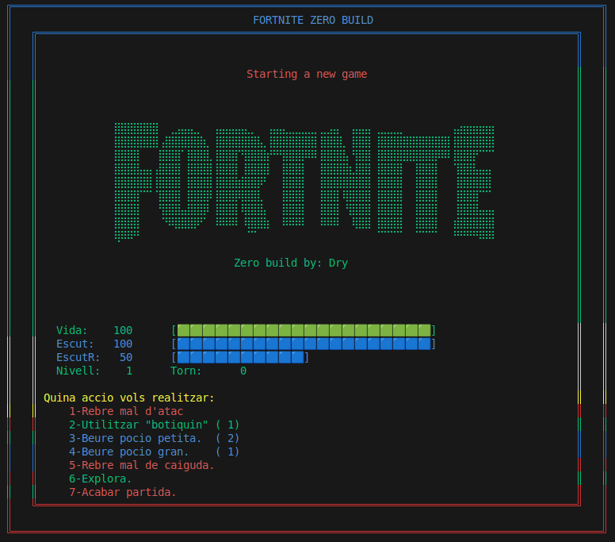
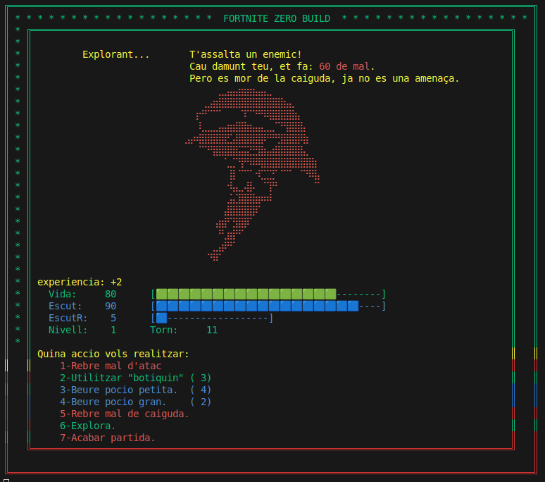
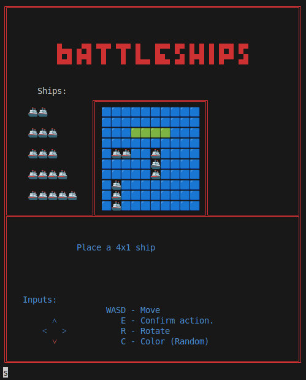
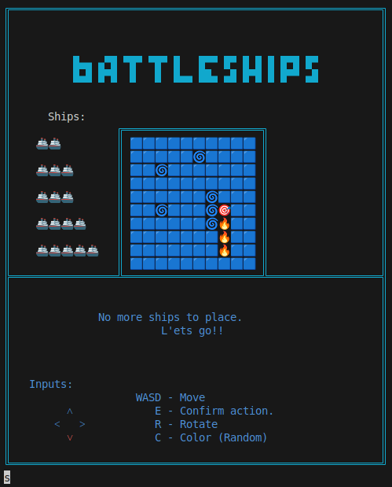

# Fortnite & Battleship Projects
This project contains the first two games i made while learning java, some details needed to properly finish.

## Fortnite Zero Build adventure

Small graphic adventure, besides the border colors and the missplacement of the death screen, it's mostly playable (If I remember correctly).

Just one loop

---
Start screenshot:

Random event ingame:

## Battleship

Using Functions and arrays

