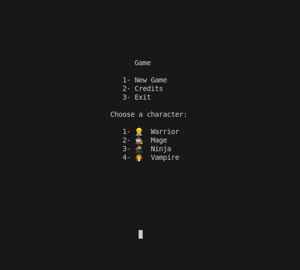
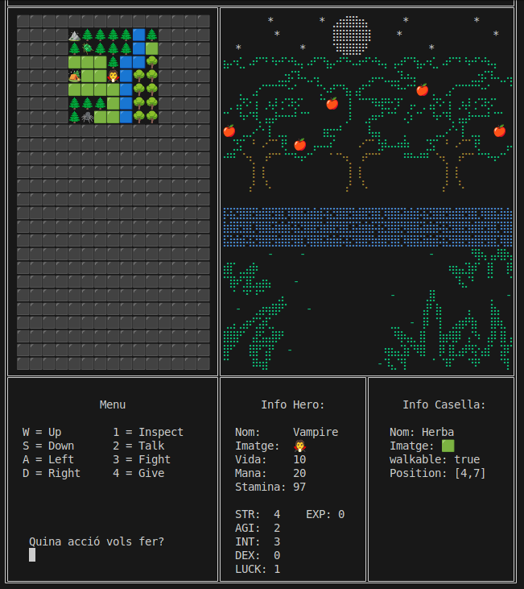
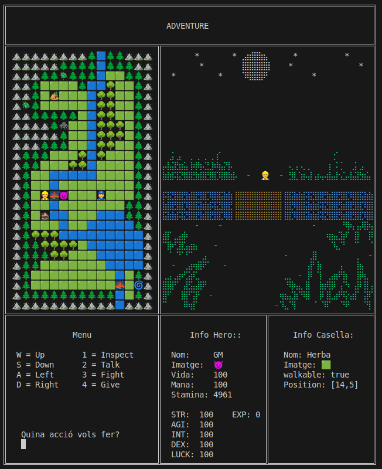

## Rpg Adventure
Most of the things I’ve learned in my first year of programming with Java in DAW are included in this small RPG wannabe.

It's not meant to be playable... but it works!

- 5 Playable Characters
- Monsters
- Npc's
- Items
- Combat
- Quests
- Night-Day cycle

---
Start menu:

Start of the adventure:

Doing a bit of exploration, we can see the landscape of the map.

We can cheat a bit selecting character number 5!

