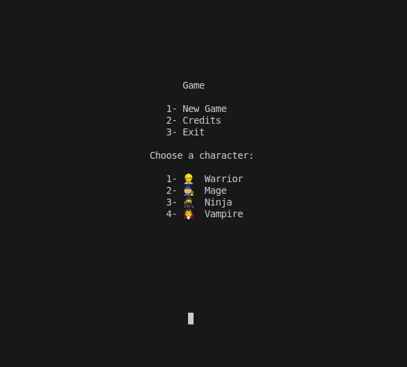
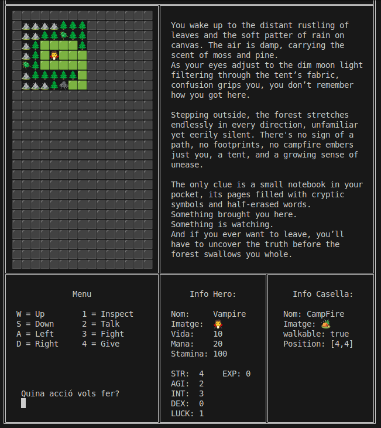
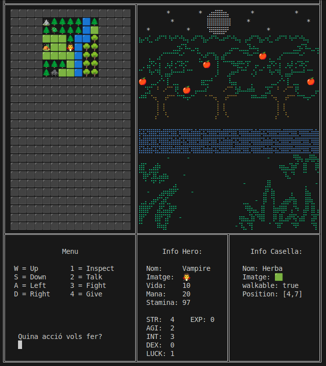
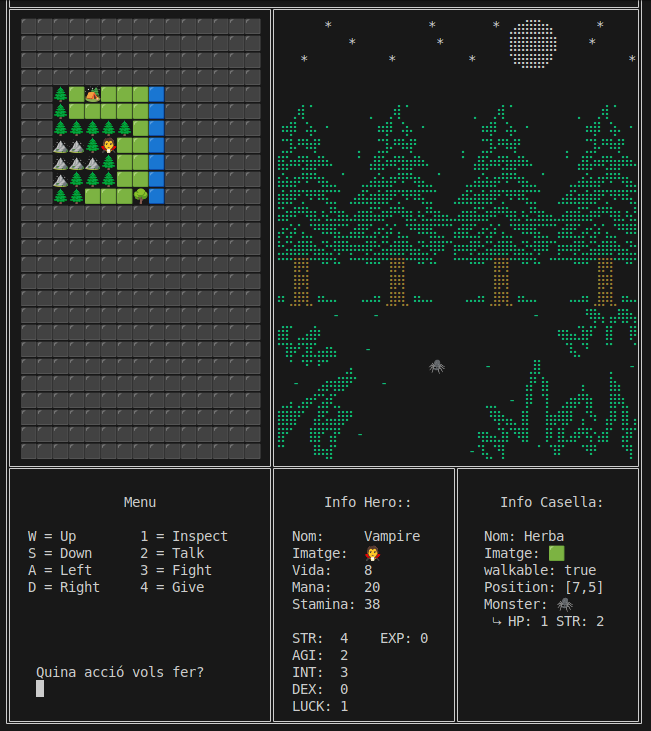
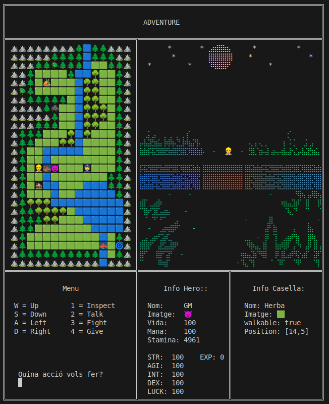

## Rpg Adventure
Most of the things I've learned the first year of programming with java in DAW are in this small RPG wannabe.

It's not meant to be playable... but it works!

- 5 Playable Characters
- Monsters
- Npc
- Objects
- Combat
- Quests

To do:

- Add stat points on level up
- Save game state

---
Main menu:

Start of the adventure:

Doing some exploration, we can see the landscape of the map.

There is a spider nearby, let's inspect and attack it!

Choose character number 5!

